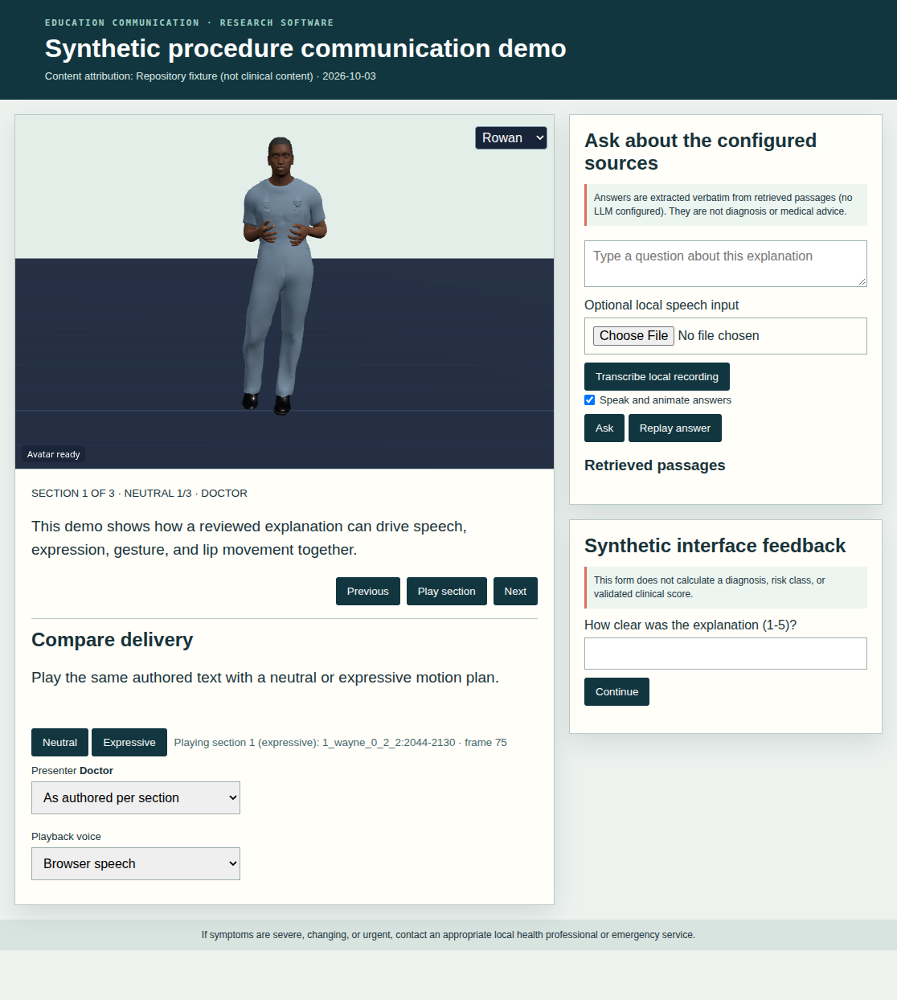

# Enhancing doctor‐patient communication in surgical explanations: Designing effective facial expressions and gestures for animated physician characters

**Hwang Youn Kim, Ghazanfar Ali, Jae‐In Hwang**

**Computer Animation and Virtual Worlds · 2024** · Published

[Paper / publisher](https://doi.org/10.1002/cav.2236) · [Project page](https://ghazanfarali.com/research/virtual-physician/) · [BibTeX](CITATION.bib) · [Requirements](REQUIREMENTS.md) · [Code & setup](#implementation-and-usage)

> Expression and gesture support surgical explanations by animated physicians.


*Graphical abstract diagram. Grounded explanations and expressive behavior support virtual-physician communication.*

## Why this research

Surgical explanations carry both factual and interpersonal information. This research designs facial expressions and co-speech gestures for an animated physician and asks how an avatar-delivered explanation compares with a conventional slide presentation. The paper's study compared an avatar explanation video with a text, image and audio slide video of the same heart-surgery content; it did not vary expression or gesture as separate study conditions.

The system lets clinicians prepare explanations with a virtual physician and lets patients ask follow-up questions. It combines grounded medical information with designed facial expression and co-speech gesture, and evaluates how users perceive the presentation.

## Method at a glance

**Surgical content / question** → **Grounded answer + behavior** → **Animated explanation**

| | Research system |
|---|---|
| Input | Clinician-prepared surgical content and patient questions |
| Method | Content preparation, grounded question answering, facial expression, and gesture |
| Output | Animated surgical explanations and grounded follow-up responses |

## Evidence and scope

113-participant study; reported answer F1 comparison 0.492 to 0.779

**Attribution:** These findings describe the paper or manuscript, not results obtained with this repository's code.

**Study context:** Surgical-explanation materials and study conditions described in the paper.

**Limitations:** This is communication research. Perceived social presence and answer scores do not demonstrate improved clinical outcomes or autonomous medical decision-making.

## Explore the implementation

Authored explanation flows with doctor/nurse personas, cited follow-up answers (extractive, or generated by a configured LLM over retrieved passages), spoken and animated answers, and a portable browser preview. It does not reproduce the paper's models or establish clinical effectiveness.

This repository contains independently written research code. The institute's original source, datasets and trained models are not distributed. Public-data preparation, commands, assumptions and checks are documented below and in [REQUIREMENTS.md](REQUIREMENTS.md).

## Resources and citation

Read the paper through its [publisher record](https://doi.org/10.1002/cav.2236). PDFs are hosted by publishers or preprint archives rather than stored in this repository.

Please cite the research paper when using its ideas; [download the BibTeX citation](CITATION.bib). The implementation has its own documented scope.

<!-- demo-preview:start -->
## Demo preview



*Local demo with small starter examples; the capture illustrates the interface, not a reproduced paper benchmark.*

From the repository root, using the Python environment described below:

```sh
python -m pip install -e .
python -m pip install -r scripts/requirements-demo.txt
python scripts/start_demo.py
```

Open **http://127.0.0.1:8080/**. Click **Play section** or **Expressive** to play the bundled synthetic explanation; try the source-grounded question form. The launcher prepares pinned Three.js modules and downloads one small official BEAT BVH/TextGrid sample on first run. It builds a nine-clip local bank and fits the Multilingual Gestures retrieval adapter (English input stays English) under ignored `outputs/beat-library/`; later runs reuse the cache. The first run needs internet access. Original recordings, large datasets, institute assets, and pretrained gesture weights are not distributed.

The 3D presentation uses shared Three.js avatar components and bundled fictional CC0 characters. The paper-specific algorithms and data adapters live in this repository.

The application uses `multilingual` retrieval for recorded co-speech motion: the multilingual gesture component adopted in section 3.5 of the paper. The clinician-authored content, grounded question answering, and questionnaire remain this application's core. The BEAT preparation and retrieval dependencies are vendored in this repository, so no sibling repository checkout is needed. See `scripts/prepare_beat_demo.py` to rebuild the ignored local bank.

<!-- demo-preview:end -->

## Implementation and usage

<!-- implementation-guide -->

This standalone repository reimplements the communication pipeline from **“Enhancing doctor-patient communication in surgical explanations: Designing effective facial expressions and gestures for animated physician characters”** by Hwang Youn Kim, Ghazanfar Ali, and Jae-In Hwang, *Computer Animation and Virtual Worlds* 35(3), e2236, 2024. DOI: [10.1002/cav.2236](https://doi.org/10.1002/cav.2236).

The original institute implementation is unavailable. This new research implementation supports clinician-authored sectioned explanations, media, expression/gesture/viseme events, source-grounded follow-up questions, and branched feedback forms. It does not contain the paper's Unity project, Faceware captures, avatars, voice/gesture assets, HealthCareMagic sample, generated medical-term data, Llama weights, participant data, or experimental results.

The paper adopts the authors' multilingual co-speech gesture preprint as its gesture-generation research lineage; see the separate [multilingual-gesture implementation](https://github.com/ghazanPK/multilingual-gesture). This demo fits a compact instance of that method on a small BEAT sample; it does not reuse the institute's weights or reproduce the paper's measured behavior.

The included quickstart uses synthetic interface fixtures without clinical review. A deployment must replace them with licensed educational sources and explanations reviewed by an accountable clinician. This software does not diagnose, recommend treatment, calculate clinical risk, handle emergencies, or replace communication with a qualified clinician.

### Setup and run

```powershell
py -3.11 -m venv .venv
.venv\Scripts\Activate.ps1
python -m pip install --upgrade pip
pip install -e ".[dev,gesture]"
python scripts/prepare_viewer.py
python scripts/prepare_beat_demo.py
virtual-physician --sources .\examples\sources.jsonl --script .\examples\script.json --questionnaire .\examples\questionnaire.json
```

`pip install -e .` installs the server with numpy. The `gesture` extra adds torch and scikit-learn, which `scripts/prepare_beat_demo.py` needs to build the local BEAT bank and fit the multilingual retrieval adapter (first run downloads one small official BEAT sample). Without the extra or the prepared bank, the server still starts; explanations and answers are spoken and animated with face and lip motion, and the UI reports that recorded co-speech gestures are unavailable.

Open [http://127.0.0.1:8000](http://127.0.0.1:8000) for the 3D explanation, neutral/expressive comparison, spoken cited answers and optional feedback flow. The bundled files are synthetic interface fixtures and contain no patient or paper data. For API and event checks, run `python scripts/verify.py` and `virtual-physician-validate .\examples\script.json`. The check writes `outputs/verify/script.json`, `answer.json`, `answer-declined.json` (an off-topic question), `answer-generated.json`, `questionnaire.json`, and `questionnaire-branch.json`; omit `--questionnaire` when feedback is not required. `answer-generated.json` exercises the generation path with a deterministic stand-in command; it checks the plumbing and citation rules, not answer quality.

### Retrieval-augmented answers with a configured LLM

The paper answers patient questions with Llama 2 7B in a retrieval-augmented generation (RAG) framework. This repository keeps the model outside the code: point the server at an OpenAI-compatible chat endpoint (a local llama.cpp, vLLM or Ollama server hosting a Llama 2 chat model, or a hosted API) or at a local command.

```powershell
virtual-physician --sources .\examples\sources.jsonl --script .\examples\script.json --llm-endpoint http://127.0.0.1:8081/v1 --llm-model llama-2-7b-chat
# or: a command that reads {"system": ..., "user": ...} JSON on stdin and prints the answer
virtual-physician --sources .\examples\sources.jsonl --script .\examples\script.json --llm-command "python my_local_llm.py"
```

The same settings can come from `VP_LLM_ENDPOINT`, `VP_LLM_MODEL`, `VP_LLM_API_KEY` and `VP_LLM_COMMAND`. The prompt (`SYSTEM_PROMPT` in `src/virtual_physician/generation.py`) supplies the floor-filtered passages as numbered context. It asks for a short patient-friendly answer that cites a passage after every sentence and replies `INSUFFICIENT_EVIDENCE` when the passages do not answer. Questions without evidence decline before any model call. A generation that cites no passage or a passage it was not given, or a failed endpoint, falls back to the extractive answer; the response labels which path produced it (`rag-generation`, `extractive-fallback`, `declined-no-evidence`, `declined-by-generator`). Citation checks do not prove that every generated sentence is supported, so generated answers still need clinical review before deployment. Without an LLM setting the server keeps the extractive answer.

### Clinician-authored explanation format

`script.json` must identify the reviewer and review date. Emotions follow the paper (`neutral`, `anger`, `disgust`, `fear`, `happiness`, `sadness`, `surprise`) and intensity is one of three presets, 1–3. The browser passes the emotion name and level unchanged to the shared renderer's expression presets:

```json
{
  "title": "Clinician-authored procedure explanation",
  "reviewed_by": "Name and role of accountable reviewer",
  "reviewed_at": "2026-10-03",
  "persona": "doctor",
  "personas": {
    "doctor": {"label": "Doctor", "avatar": "rowan", "voice": {"language": "en-US", "pitch": 0.92, "rate": 0.98, "kokoro_voice": "af_heart"}},
    "nurse": {"label": "Nurse", "avatar": "mira", "voice": {"language": "en-US", "pitch": 1.12, "browser_voice": "Samantha", "kokoro_voice": "af_heart"}}
  },
  "answer_emotion": {"emotion": "happiness", "intensity": 1},
  "sections": [
    {
      "id": "overview",
      "text": "Insert the clinician-approved explanation here.",
      "emotion": "neutral",
      "intensity": 1,
      "gesture": "auto",
      "media_url": "https://your-approved-host.example/illustration.png",
      "media_alt": "Clinician-approved description of the illustration"
    },
    {
      "id": "procedure-video",
      "text": "This short clip shows the steps of the procedure.",
      "emotion": "neutral",
      "intensity": 2,
      "gesture": "point_media",
      "video_url": "https://your-approved-host.example/procedure.mp4",
      "persona": "nurse"
    }
  ]
}
```

- **Personas.** As in the paper, the presenter can be a doctor or a nurse. `persona` sets the script default and a section may override it. Each persona binds a bundled avatar (`rowan` or `mira`) and a voice. Browser speech uses `language`, `pitch`, `rate` and an optional `browser_voice` name fragment. Local Kokoro uses `kokoro_voice`, a file under `KOKORO_MODEL_DIR/voices/`. `personas` is optional; the defaults are shown above. The viewer can also switch presenter in the **Presenter** menu.
- **Gestures.** `gesture` is optional. `auto` (or omitted) retrieves recorded BEAT co-speech motion for the section text. Any other name, such as `open_hand`, `reassure`, `point_media` or `nod`, is an authored override: playback uses that named pose instead of retrieval.
- **Media.** `media_url` shows an image. `video_url` shows a direct MP4/WebM file, which starts muted when the section is played so the presenter's voice stays audible. Page links such as YouTube watch URLs are not playable media files. Media remains on its configured host. Confirm copyright, accessibility, and patient-education suitability before use.
- **Answer style.** `answer_emotion` sets the face used for grounded answers. Declined questions use a neutral face.

### Grounded source format

`sources.jsonl` contains one reviewed passage per line:

```json
{"source_id":"stable-id","title":"Public reference title","url":"https://authoritative.example/page","reviewed_at":"2026-10-03","text":"A licensed or permitted passage reviewed for this deployment."}
```

The local TF-IDF retriever removes English stopwords and folds simple suffixes before ranking passages. A passage counts as evidence only when its cosine score reaches `min_score` (0.12) and it contains at least `min_coverage` (34%) of the question's content words. Questions without such evidence, for example "What is the capital of France?", decline and direct the user to the clinical team. The tests keep these off-topic questions as regressions. These floors are tuned on the bundled fixture and are lexical: paraphrases that share no content words with a passage also decline. Re-check both values on a deployment corpus. Without an LLM, the answer selects relevant sentences verbatim from the evidence. With an LLM, the answer is generated from the evidence and cites it, as described above. Every grounded answer includes clickable provenance, and the pane lists the top-ranked passages with their score, coverage and whether they cleared the floor.

A practical public starting point is [MedlinePlus for Developers](https://medlineplus.gov/about/developers/), maintained by the U.S. National Library of Medicine. Its APIs, XML files, and linking options have different usage rules. The [MedlinePlus Connect service documentation](https://medlineplus.gov/medlineplus-connect/web-service/) says returned service data may be linked/displayed under its acceptable-use terms and warns against copying MedlinePlus pages wholesale. Preserve source URLs, attribution, review dates, and the terms of every source. User-provided hospital materials require their own authorization and review.

### Research feedback form

An optional `questionnaire.json` defines `choice`, `number`, `text`, and `message` items, default `next` edges, and `eq`/`gte`/`lte` branches. It is a navigation and feedback mechanism only. The loader rejects fields named `diagnosis`, `risk_score`, or `clinical_score`; the runtime returns only the next item ID and does not compute or claim a validated diagnostic result.

The browser keeps answers in page memory and this server does not persist them. Do not request identifying or sensitive health information without an approved privacy, security, consent, and data-retention design.

### Swap in reviewed deployment content

Copy the three example files, preserve their documented keys, and replace their synthetic text with licensed, reviewed material. Point the same `virtual-physician` command at the new paths; no code change is required. `scripts/verify.py` exercises the same app factory and API routes used by the server, including the explanation, cited question-answering, behavior events, and questionnaire branch.

### Browser event preview

Each section and each answer carries four parallel events: `speech` (the spoken text), `expression` (emotion name plus level 1–3), `gesture` (`auto` for recorded retrieval or an authored pose name) and `viseme` (lip motion derived from the spoken text). The browser renders all four. It calls the shared renderer's `setExpression(name, level)` when available; older renderer copies fall back to their four-emotion scale. Lip motion uses the shared speech path's text-to-phoneme visemes where the renderer provides them, otherwise an amplitude envelope. Blink and idle motion also come from the shared renderer. Answers are spoken in the current presenter's voice with the configured answer face and recorded gestures retrieved for the answer text through `/api/beat-query`. Untick **Speak and animate answers** for text only, or use **Replay answer**.

Not reproduced: the paper's Unity scene, Naver TTS, SALSA lip sync, Faceware-captured expressions, its doctor and nurse character assets, the fine-tuned and RAG Llama 2 7B models with their vector store, the HealthCareMagic/BERTScore comparison (Table 1) and the 113-participant study (Table 2). Browser speech and text-derived visemes are portable approximations, not a validated bedside interface.


### Public source import and 3D browser playback

`python -m virtual_physician.importer` imports one explicitly selected public educational page into a local JSONL collection. It records the HTTPS source URL and supplied review date; inspect and edit the extracted text before serving. This is a preparation tool, not clinician review. The authored explanation script remains a separate file. Do not replace its `reviewed_by` field with an automated importer or claim review that did not occur.

```powershell
python -m virtual_physician.importer "https://your-permitted-educational-source.example/page" --file data/page.html --id page-1 --title "Source title" --reviewed-at 2026-10-05 --out data/sources.jsonl
virtual-physician --sources data/sources.jsonl --script data/approved-script.json
```

The browser presents the same authored explanation in neutral and expressive delivery with bundled fictional CC0 characters. Expressive speech uses locally prepared BEAT clips through the vendored multilingual retrieval adapter, unless a section authors its own gesture. The Q&A pane shows ranked source passages and the cited answer, labelled as extractive or generated, separately from scripted clinical content. Browser speech and typed questions work without models. The quickstart prepares the pinned renderer in ignored `static/vendor/` and a small BEAT retrieval artifact in ignored `outputs/beat-library/`; no original avatar assets or pretrained model weights are included. For optional local speech, run `python -m pip install -e ".[speech]"`, prepare the English phonemizer dependencies in [Kokoro's setup guide](https://github.com/hexgrad/kokoro) (including `espeak-ng` where required), and set `KOKORO_MODEL_DIR` to a user-owned folder with `config.json`, `kokoro-v1_0.pth`, and `voices/af_heart.pt` (plus any other `kokoro_voice` named by a persona). Set `WHISPER_MODEL_DIR` to a local converted faster-whisper folder with `model.bin`. The UI reports configuration errors and leaves browser speech and typed input available.

<!-- avatar-recorded-motion:start -->
## Bundled characters and recorded public motion

The browser demos include Rowan and Mira, two new fictional GLB characters built with MPFB and MakeHuman community assets under CC0 1.0. See [avatar licensing and provenance](static/avatars/LICENSE.md). Use the character selector in the stage. The shared renderer supports body bones, ARKit facial channels, and approximate speaking motion.

Recorded motion is adapted to the characters' proportions. Palm landmarks set hand orientation; finger curl uses bounded hinge bends and preserves the character's finger spacing. Thumb-base opposition stays in the authored pose, with conservative recorded curl at the remaining joints. Distal bends are estimated from the preceding joint when fingertip landmarks are absent. Use the companion's hand close-up views to inspect the result.

The [avatar motion companion](static/recorded-motion.html) opens at `/static/recorded-motion.html` while the demo server is running. A small authored motion and face sample loads automatically; click **Play** without uploading files. It also plays locally selected BEAT motion, face, and WAV files on the bundled characters. These are presentation and data-inspection tools, separate from the paper implementation. No BEAT recording, dataset archive, or trained model is bundled. For recorded public motion, install the one preparation dependency and fetch a small official sample into ignored `outputs/beat-demo/`:

```sh
python -m pip install numpy
python scripts/beat_demo/fetch_modalities.py --speaker 1 --sequence 1_wayne_0_1_1 --include-bvh --max-bytes 25000000 --output-dir outputs/beat-demo/source
python scripts/beat_demo/prepare_bvh.py --bvh outputs/beat-demo/source/1_wayne_0_1_1.bvh --output outputs/beat-demo/sample/1_wayne_0_1_1-raw-motion.json --frames 120
python scripts/beat_demo/prepare_modalities.py --sequence 1_wayne_0_1_1 --source outputs/beat-demo/source --output outputs/beat-demo/sample --frames 120
```

Open the companion and select `outputs/beat-demo/sample/1_wayne_0_1_1-raw-motion.json`, `1_wayne_0_1_1-face.json`, and `1_wayne_0_1_1.wav`. The downloader caps each original file at 25 MB; the prepared clip contains up to 120 frames. The viewer uses local files and does not upload them. For other BEAT takes, substitute a matching official speaker and sequence ID.

If you already have OmniMo's processed 52-joint Unity humanoid data, use that normalized motion instead:

```sh
python scripts/beat_demo/prepare.py --dataset /path/to/processed/beat --speaker 1 --take 1_wayne_0_1_1 --output outputs/beat-demo/sample/1_wayne_0_1_1-motion.json --max-frames 120
```

Select the resulting `*-motion.json` in the companion. Its metadata carries the humanoid joint mapping and source-to-avatar coordinate conversion. The viewer fits source FK directions from the avatar's bind pose, following the spine explicitly at branching joints. This avoids applying incompatible source bone twist to the MPFB skin; it does not reproduce exact performer twist. The adapter supports Unity proximal/intermediate/distal finger names. Raw BVH remains a public-data alternative; do not mix the two skeleton conventions.
<!-- avatar-recorded-motion:end -->
