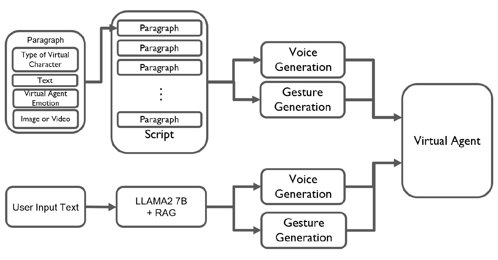

# Enhancing doctor‐patient communication in surgical explanations: Designing effective facial expressions and gestures for animated physician characters

**Hwang Youn Kim, Ghazanfar Ali, Jae‐In Hwang**

**Computer Animation and Virtual Worlds · 2024** · Published

[Paper / publisher](https://doi.org/10.1002/cav.2236) · [Project page](https://ghazanfarali.com/research/virtual-physician/) · [BibTeX](CITATION.bib) · [Requirements](REQUIREMENTS.md) · [Code & setup](#implementation-and-usage)

> Expression and gesture support surgical explanations by animated physicians.



*Original method figure from the paper: Figure 2, PDF page 4. Extracted for this research introduction; the diagram describes the original system, not verification of this reimplementation.*

## Why this research

Surgical explanations carry both factual and interpersonal information. This research studies how facial expression and co-speech gesture shape the experience of receiving an explanation from an animated physician.

The system lets clinicians prepare explanations with a virtual physician and lets patients ask follow-up questions. It combines grounded medical information with designed facial expression and co-speech gesture, and evaluates how users perceive the presentation.

## Method at a glance

**Surgical content / question** → **Grounded answer + behavior** → **Animated explanation**

| | Research system |
|---|---|
| Input | Clinician-prepared surgical content and patient questions |
| Method | Content preparation, grounded question answering, facial expression, and gesture |
| Output | Animated surgical explanations and grounded follow-up responses |

## Evidence and scope

113-participant study; reported answer F1 comparison 0.492 to 0.779

**Attribution:** These findings describe the paper or manuscript, not results obtained with this repository's code.

**Study context:** Surgical-explanation materials and study conditions described in the paper.

**Limitations:** This is communication research. Perceived social presence and answer scores do not demonstrate improved clinical outcomes or autonomous medical decision-making.

## Explore the implementation

Authored explanation flows, sourced follow-up retrieval, facial/gesture/voice events and a portable browser preview. It does not reproduce the paper's models or establish clinical effectiveness.

This repository contains independently written research code. The institute's original source, datasets and trained models are not distributed. Public-data preparation, commands, assumptions and checks are documented below and in [REQUIREMENTS.md](REQUIREMENTS.md).

## Resources and citation

Read the paper through its [publisher record](https://doi.org/10.1002/cav.2236). PDFs are hosted by publishers or preprint archives rather than stored in this repository.

Please cite the research paper when using its ideas; [download the BibTeX citation](CITATION.bib). The implementation has its own documented scope.

## Implementation and usage

<!-- implementation-guide -->

This standalone repository reimplements the communication pipeline from **“Enhancing doctor-patient communication in surgical explanations: Designing effective facial expressions and gestures for animated physician characters”** by Hwang Youn Kim, Ghazanfar Ali, and Jae-In Hwang, *Computer Animation and Virtual Worlds* 35(3), e2236, 2024. DOI: [10.1002/cav.2236](https://doi.org/10.1002/cav.2236).

The original institute implementation is unavailable. This new research implementation supports clinician-authored sectioned explanations, media, expression/gesture/viseme events, source-grounded follow-up questions, and branched feedback forms. It does not contain the paper's Unity project, Faceware captures, avatars, voice/gesture assets, HealthCareMagic sample, generated medical-term data, Llama weights, participant data, or experimental results.

This software presents reviewed educational material. It does not diagnose, recommend treatment, calculate clinical risk, handle emergencies, or replace communication with a qualified clinician.

### Setup and run

```powershell
py -3.11 -m venv .venv
.venv\Scripts\Activate.ps1
python -m pip install --upgrade pip
pip install -e ".[dev]"
python scripts/smoke.py
virtual-physician-validate .\examples\script.json
virtual-physician --sources .\examples\sources.jsonl --script .\examples\script.json --questionnaire .\examples\questionnaire.json
```

The smoke run writes `outputs/smoke/script.json`, `answer.json`, `questionnaire.json`, and `questionnaire-branch.json` from the real API routes. Inspect `answer.json` for the cited passage and synchronized expression, gesture, speech, and viseme events. Then open [http://127.0.0.1:8000](http://127.0.0.1:8000) after starting the server. Omit `--questionnaire` when feedback is not required. The bundled files are synthetic interface fixtures and contain no patient or paper data.

### Clinician-authored explanation format

`script.json` must identify the reviewer and review date. Emotions follow the paper (`neutral`, `anger`, `disgust`, `fear`, `happiness`, `sadness`, `surprise`) and intensity is 1–3:

```json
{
  "title": "Clinician-authored procedure explanation",
  "reviewed_by": "Name and role of accountable reviewer",
  "reviewed_at": "2026-10-03",
  "sections": [
    {
      "id": "overview",
      "text": "Insert the clinician-approved explanation here.",
      "emotion": "neutral",
      "intensity": 1,
      "gesture": "open_hand",
      "media_url": "https://your-approved-host.example/illustration.png",
      "media_alt": "Clinician-approved description of the illustration"
    }
  ]
}
```

Media remains on its configured host. Confirm copyright, accessibility, and patient-education suitability before use.

### Grounded source format

`sources.jsonl` contains one reviewed passage per line:

```json
{"source_id":"stable-id","title":"Public reference title","url":"https://authoritative.example/page","reviewed_at":"2026-10-03","text":"A licensed or permitted passage reviewed for this deployment."}
```

The local TF-IDF retriever ranks passages and the default answer selects relevant sentences verbatim from those passages. Every returned answer includes clickable provenance. If nothing matches, it declines and directs the user to the clinical team. This is deliberately conservative; a generative model may only be added after a clinical review process that checks every answer against retrieved evidence.

A practical public starting point is [MedlinePlus for Developers](https://medlineplus.gov/about/developers/), maintained by the U.S. National Library of Medicine. Its APIs, XML files, and linking options have different usage rules. The [MedlinePlus Connect service documentation](https://medlineplus.gov/medlineplus-connect/web-service/) says returned service data may be linked/displayed under its acceptable-use terms and warns against copying MedlinePlus pages wholesale. Preserve source URLs, attribution, review dates, and the terms of every source. User-provided hospital materials require their own authorization and review.

### Research feedback form

An optional `questionnaire.json` defines `choice`, `number`, `text`, and `message` items, default `next` edges, and `eq`/`gte`/`lte` branches. It is a navigation and feedback mechanism only. The loader rejects fields named `diagnosis`, `risk_score`, or `clinical_score`; the runtime returns only the next item ID and does not compute or claim a validated diagnostic result.

The browser keeps answers in page memory and this server does not persist them. Do not request identifying or sensitive health information without an approved privacy, security, consent, and data-retention design.

### Swap in reviewed deployment content

Copy the three example files, preserve their documented keys, and replace their synthetic text with licensed, reviewed material. Point the same `virtual-physician` command at the new paths; no code change is required. `scripts/smoke.py` exercises the same app factory and API routes used by the server, including the explanation, cited question-answering, behavior events, and questionnaire branch.

### Browser event preview

The CSS character demonstrates the event contract: speech, one facial state with intensity, gesture, and timed viseme cues run in parallel. Browser speech synthesis and text-derived visemes are portable approximations, not the paper's Naver TTS, SALSA lip sync, Faceware expressions, multilingual gesture system, or a validated bedside interface.
